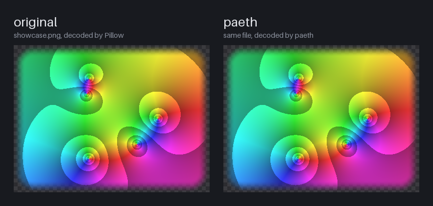
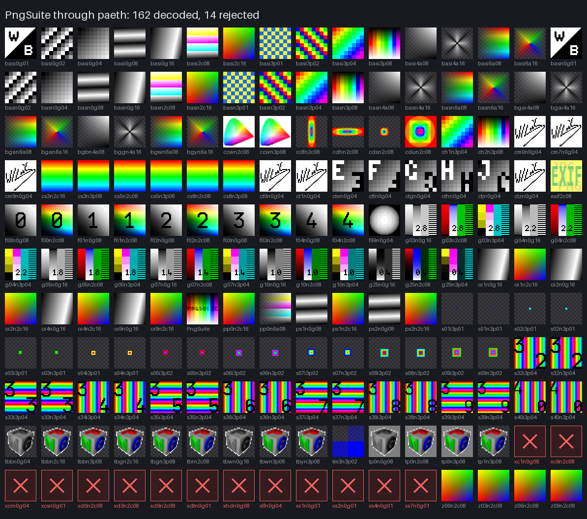

# paeth

[](https://github.com/ElatDev/paeth/actions/workflows/ci.yml)
[](LICENSE)
[](https://www.rust-lang.org)

A PNG decoder written from the specification, in Rust. It takes a `.png` file
and hands back RGBA pixels — every color type, every bit depth, Adam7
interlacing included. It is deliberately strict: it checks every CRC, enforces
the chunk ordering rules, and rejects files the spec calls broken instead of
guessing at them.

Read-only. No encoder, no resizing, no color management. One runtime
dependency, `flate2`, for inflate.



*A 16-bit RGBA, Adam7-interlaced test image with a feathered alpha edge —
the hard paths in one file. Left, decoded by Pillow; right, by paeth. paeth's
16-bit output matches pypng's on all 480,000 samples; the figure is generated
by [`tools/make_figures.py`](tools/make_figures.py), which fails if a single
sample differs.*

## The claim

> **Decodes all 162 valid images in PngSuite pixel-for-pixel identically to an
> independent decoder, and rejects all 14 corrupt ones — each for the reason
> PngSuite documents.**

```console
$ cargo test --test pngsuite -- --nocapture
PngSuite: 162 decoded pixel-exact, 14 corrupt files rejected
test result: ok. 4 passed; 0 failed; 0 ignored; 0 measured; 0 filtered out
```



[PngSuite](http://www.schaik.com/pngsuite/) is 176 images built to break
decoders: every bit depth, every color type, both interlace modes, odd sizes,
ancillary chunks — and 14 files that are corrupt on purpose, which a correct
decoder has to reject.

### Why you can believe it

**The expected pixels are not paeth's own output.**
[`tools/gen_reference.py`](tools/gen_reference.py) decodes every file with
[pypng](https://gitlab.com/drj11/pypng), a pure-Python decoder written by
somebody else, and writes the SHA-256 of the resulting RGBA8 and RGBA16 pixels
to [`tests/pngsuite/reference.tsv`](tests/pngsuite/reference.tsv). The test
compares against those hashes. CI regenerates the file and fails if it differs,
so the hashes cannot quietly drift toward whatever paeth happens to produce.

**A third decoder checks the second.** The same script decodes each file with
Pillow and compares. Pillow agrees with pypng on 161 of the 162 valid files.
The one disagreement is a Pillow bug: in `tbbn0g04.png`, 4-bit gray with
`tRNS` marking gray value 15 transparent, Pillow compares the key against the
sample *after* scaling it to 8 bits (255), so nothing matches and 464 channel
values come out opaque. The spec compares raw samples, pypng does, and so does
paeth. The script knows about that one case and fails on any other
disagreement.

**Rejection has to be for the right reason.** "Rejected" is easy to get by
accident. Each corrupt file is asserted against the specific error PngSuite
says it contains — a bad IHDR checksum has to fail as an IHDR CRC error, not
as something else downstream.

**The test has teeth.** Three deliberate bugs, each a one-line change, and
what the conformance test did:

| Injected bug | Files that failed |
|---|---|
| Paeth predictor tie broken toward `b` instead of `a` | 19 of 176 |
| 16→8 bit rescaling truncated instead of rounded | 25 of 176 |
| Adam7 pass 7 starting at column 1 instead of 0 | 34 of 176 |

## Install

Not on crates.io. Clone it and build:

```console
$ git clone https://github.com/ElatDev/paeth && cd paeth
$ cargo build --release      # target/release/paeth
$ cargo install --path .     # or put the CLI on your PATH
```

Rust 1.85 or newer. To depend on it from another crate:

```toml
[dependencies]
paeth = { git = "https://github.com/ElatDev/paeth", tag = "v0.1.0" }
```

## Library

```rust
let image = paeth::decode(&bytes)?;            // RGBA8, row-major, straight alpha
let [r, g, b, a] = image.pixel(10, 4);
let precise = paeth::decode_rgba16(&bytes)?;   // lossless for every bit depth
```

Look before you decode:

```rust
let png = paeth::Png::parse(&bytes)?;          // chunks, CRCs, ordering, metadata
let header = png.header();
println!("{}x{} {} at {} bits", header.width, header.height, header.color_type, header.bit_depth);
for text in &png.metadata().text {
    println!("{}: {}", text.keyword, text.text);
}
for warning in png.warnings() {                // skipped ancillary chunks
    eprintln!("{warning}");
}
let image = png.decode()?;
```

`Png::parse` reads the whole chunk stream but does not inflate anything, so
listing metadata for a large file is cheap. Decoding is a separate step, and
can be done at 8 or 16 bits from the same parse.

Sample values are rescaled with the spec's preferred formula (section 13.12),
`round(sample × MAXOUT / MAXIN)`. That is exact whenever the target depth is a
multiple of the source depth — 1-bit white becomes 255, 4-bit `0x9` becomes
`0x99` — and rounds, rather than truncates, going from 16 bits to 8.

See [`examples/decode.rs`](examples/decode.rs) for a complete program.

## Command line

```console
$ paeth docs/showcase.png
showcase.png  (827,528 bytes)
  size         400 x 300
  format       RGBA, 16-bit, Adam7-interlaced
  gamma        0.45455 (stored 45455, not applied)
  chunks       IHDR gAMA IDAT IEND
  decoded      OK, 120,000 pixels
```

Point it at a directory and it reports one line per file:

```console
$ paeth tests/pngsuite
OK      PngSuite.png    256x256 RGB, 8-bit
OK      basi0g01.png    32x32 grayscale, 1-bit, Adam7-interlaced
...
REJECT  xcsn0g01.png    IDAT chunk at offset 49 fails its CRC (stored 4353554d, computed d02f14c9)
REJECT  xlfn0g04.png    bad PNG signature: line endings were converted (CR to LF): the file was transferred as text

176 files: 162 decoded, 14 rejected
```

| Flag | |
|---|---|
| `-c`, `--chunks` | every chunk with its offset, length and CRC |
| `-p`, `--preview` | draw the image in the terminal in 24-bit color |
| `-o FILE` | write the decoded pixels as a PAM file (a raw dump with a text header, not an encoder) |
| `--16` | with `-o`, 16 bits per channel |
| `-v`, `--verbose` | full report for every file |

Exit status is 0 if every file decoded, 1 if any was rejected, 2 for bad usage.

### The signature says how the file was damaged

The eight-byte PNG signature is designed so that the classic ways of mangling a
binary file leave a recognisable mark. paeth reports which one it found:

| File | Diagnosis |
|---|---|
| `xs1n0g01.png` | first byte is 0x09, not 0x89: the file passed through a 7-bit channel |
| `xlfn0g04.png` | line endings were converted (CR to LF): the file was transferred as text |
| `xcrn0g04.png` | line endings were converted (LF to CR): the file was transferred as text |

## What it supports

| | |
|---|---|
| Color types | grayscale, RGB, indexed, gray+alpha, RGBA (0, 2, 3, 4, 6) |
| Bit depths | 1, 2, 4, 8, 16, in every combination the spec allows |
| Interlacing | none and Adam7, including passes that are empty for narrow images |
| Critical chunks | IHDR, PLTE, IDAT (split anywhere), IEND |
| Ancillary chunks parsed | tRNS, gAMA, cHRM, sRGB, iCCP, sBIT, bKGD, hIST, pHYs, sPLT, tIME, tEXt, zTXt, iTXt, eXIf, and the PNG Third Edition trio cICP, mDCV, cLLI |

`tRNS` is applied, because it is how a file says which pixels are transparent.
Nothing else is: gamma, chromaticity, ICC profiles and `sBIT` are reported in
`Metadata` and left alone, so the pixels you get are the samples the file
stores. In an APNG, the default image is decoded and the animation chunks are
ignored.

Not here, on purpose: encoding, scaling, filtering, color management, APNG
frames.

## Strictness

Errors — the file is rejected:

- the signature is wrong, in any of the ways above
- a chunk is truncated, longer than 2³¹−1, has a non-letter type, or fails its
  CRC (**every** chunk's CRC, ancillary ones included)
- IHDR is missing, misplaced, repeated, the wrong length, or names a size,
  color type, bit depth, compression, filter or interlace method the spec does
  not define
- a critical chunk this decoder does not know: the image may depend on it
- IDAT chunks that are not consecutive, PLTE after IDAT or in a grayscale
  image, a palette longer than the bit depth can index, a missing PLTE in an
  indexed image, IEND missing or non-empty
- image data that is corrupt, too short, too long, or followed by bytes after
  the end of its zlib stream
- a filter type above 4, or a pixel indexing past the end of the palette

Warnings — the chunk is skipped and the image still decodes, which is what the
spec asks of ancillary chunks:

The CLI prints them under the file, and `Png::warnings()` returns them:

```text
  warning      gAMA at offset 33 ignored: length is 2, expected 4
  warning      tRNS at offset 61 ignored: duplicate; only the first one counts
  warning      pHYs at offset 245 ignored: must come before IDAT
```

## Robustness

- **1,584,000 mutated files, zero panics.** Six mutation strategies, run over
  every PngSuite file: bit flips, truncation, chunk-data edits, IHDR field
  swaps, chunk reordering, and corrupted scanlines *recompressed* into a valid
  zlib stream. Most of them repair the CRCs afterwards, so the damage reaches
  the parser, the inflater, the unfilter and the palette lookup instead of
  stopping at the checksum. 349,399 of those files still decoded; the rest were
  rejected; none crashed the decoder. `cargo test --test robustness` runs
  42,240 of them in about a second; CI runs the full 1.5 million.
- **No `unsafe`,** enforced by `#![forbid(unsafe_code)]`.
- **Allocation follows the data, not the header.** A 100-byte file claiming to
  be 16384×16384 fails on the data it actually has, without ever reserving the
  size it claims. Decompression stops one byte past the expected length, so a
  zip bomb in IDAT cannot expand without bound, and compressed text and ICC
  chunks have their own cap. Both limits are adjustable through `Limits`.

## Tests

121 tests, no test-only dependencies.

| Suite | | |
|---|---|---|
| unit | 76 | CRC-32 against its published check value; chunk framing (truncation at every byte offset, bad CRCs, oversized lengths); IHDR validation across all 65,536 color-type × bit-depth combinations; the Paeth predictor against an independent formulation for **all 16,777,216 inputs**; filter round-trips for every filter and stride; bit unpacking against bit-string slicing; Adam7 geometry against the spec's 8×8 diagram for every size up to 24×24; rescaling against bit replication |
| `pngsuite` | 4 | the conformance run above |
| `malformed` | 36 | hand-built files, each broken in exactly one way |
| `robustness` | 1 | the mutation soak |
| CLI + doc tests | 4 | |

The interesting ones test against something that was not written alongside the
code: the predictor against a different formulation of the same rule, the
unpacker against a string of bits, the pass geometry against the diagram in the
spec, and the whole decoder against pypng.

## How it works

```
bytes
  ├─ signature check .......... 8 bytes, with a diagnosis when wrong   chunk.rs
  ├─ chunk stream ............. length, type, data, CRC, verified      chunk.rs
  ├─ structure ................ ordering rules, IHDR, PLTE, metadata   png.rs, header.rs, metadata.rs
  ├─ IDAT concatenated ........ one zlib stream, split arbitrarily     inflate.rs
  ├─ inflate .................. exactly as many bytes as the rows need inflate.rs
  └─ per Adam7 pass (1 for a non-interlaced image)                     adam7.rs
        ├─ unfilter ........... None, Sub, Up, Average, Paeth          filter.rs
        ├─ unpack samples ..... 1/2/4/8/16 bits, MSB first             unpack.rs
        └─ to RGBA ............ palette, tRNS, rescale, scatter        pixels.rs
```

Four things account for most decoder bugs, and each has its own tests:

- **IDAT is one stream, not one per chunk.** A deflate block, or even the zlib
  header, can straddle a chunk boundary. `malformed.rs` splits a stream at
  every byte offset, and at one byte per chunk, and expects identical pixels.
- **Filters work on bytes, and "the pixel to the left" is a byte offset.** At
  depths below 8 it rounds up to 1, so a 1-bit image subtracts the previous
  byte — eight pixels back.
- **Adam7 passes that contain no pixels contribute nothing at all,** not even a
  filter byte. A 1×1 interlaced image has one scanline, not seven.
- **`tRNS` compares raw stored samples.** Scaling the sample first is the bug
  Pillow has.

## Reproducing everything

```console
$ cargo test                                 # 121 tests
$ uv run tools/gen_reference.py              # regenerate the reference hashes (pypng + Pillow)
$ cargo build --release && uv run tools/make_figures.py   # redraw the figures above
```

The two Python scripts pin their own dependencies inline and run under
[uv](https://docs.astral.sh/uv/) with no setup. Nothing in `cargo test` needs
Python.

## Dependencies

```
paeth
└── flate2 1.1        (inflate)
    ├── crc32fast     (flate2's gzip checksum; PNG's own CRC is in crc.rs)
    └── miniz_oxide   (pure-Rust inflate backend)
```

## License

MIT — see [LICENSE](LICENSE). The PngSuite images in `tests/pngsuite` are
© Willem van Schaik and redistributed under
[their own permissive license](tests/pngsuite/PngSuite.LICENSE).
