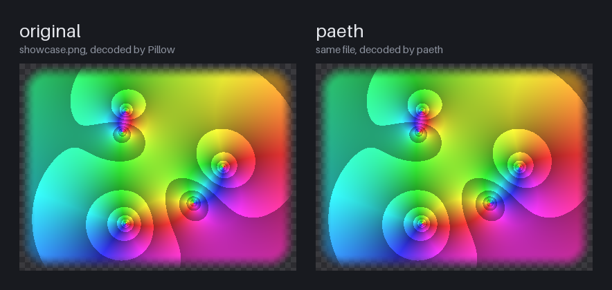
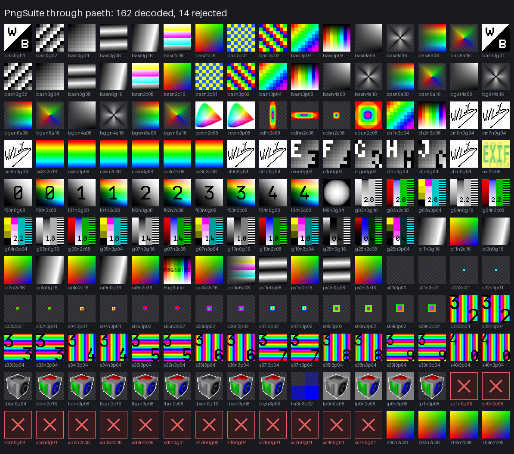

# paeth

[](https://github.com/ElatDev/paeth/actions/workflows/ci.yml)
[](LICENSE)
[](https://www.rust-lang.org)

A PNG decoder in Rust, written from the specification. It takes a `.png` file
and returns RGBA pixels, for every color type and bit depth, Adam7 interlacing
included. It's strict: it checks every CRC, enforces the chunk ordering rules,
and rejects files the spec calls broken instead of guessing at them.

It only decodes. There's no encoder, resizing or color management, and the one
runtime dependency is `flate2`, for inflate.



*A 16-bit RGBA, Adam7-interlaced test image with a feathered alpha edge, which
covers the hard paths in one file. Left, decoded by Pillow; right, by paeth.
paeth's 16-bit output matches pypng's on all 480,000 samples. The figure is
generated by [`tools/make_figures.py`](tools/make_figures.py), which fails if a
single sample differs.*

I wrote it to learn Rust on something where correctness can be measured. PNG is
small enough to implement completely (signature, chunks, one zlib stream, five
filters, seven interlace passes), and PngSuite exists specifically to break
decoders.

It decodes all 162 valid images in PngSuite pixel-for-pixel identically to an
independent decoder, and rejects all 14 corrupt ones, each for the reason
PngSuite documents. See [Testing](#testing) for how that's checked.

## Install

Not on crates.io. Clone it and build:

```console
$ git clone https://github.com/ElatDev/paeth && cd paeth
$ cargo build --release      # target/release/paeth
$ cargo install --path .     # or put the CLI on your PATH
```

Rust 1.85 or newer. To depend on it from another crate:

```toml
[dependencies]
paeth = { git = "https://github.com/ElatDev/paeth", tag = "v0.1.0" }
```

## Library

```rust
let image = paeth::decode(&bytes)?;            // RGBA8, row-major, straight alpha
let [r, g, b, a] = image.pixel(10, 4);
let precise = paeth::decode_rgba16(&bytes)?;   // lossless for every bit depth
```

To inspect a file before decoding it:

```rust
let png = paeth::Png::parse(&bytes)?;          // chunks, CRCs, ordering, metadata
let header = png.header();
println!("{}x{} {} at {} bits", header.width, header.height, header.color_type, header.bit_depth);
for text in &png.metadata().text {
    println!("{}: {}", text.keyword, text.text);
}
for warning in png.warnings() {                // skipped ancillary chunks
    eprintln!("{warning}");
}
let image = png.decode()?;
```

`Png::parse` reads the whole chunk stream but doesn't inflate anything, so
listing metadata for a large file is cheap. Decoding is a separate step and
can be done at 8 or 16 bits from the same parse.

Sample values are rescaled with the spec's preferred formula (section 13.12),
`round(sample × MAXOUT / MAXIN)`. That's exact whenever the target depth is a
multiple of the source depth (1-bit white becomes 255, 4-bit `0x9` becomes
`0x99`), and going from 16 bits to 8 it rounds instead of truncating.

See [`examples/decode.rs`](examples/decode.rs) for a complete program.

## Command line

```console
$ paeth docs/showcase.png
showcase.png  (827,528 bytes)
  size         400 x 300
  format       RGBA, 16-bit, Adam7-interlaced
  gamma        0.45455 (stored 45455, not applied)
  chunks       IHDR gAMA IDAT IEND
  decoded      OK, 120,000 pixels
```

Point it at a directory and it reports one line per file:

```console
$ paeth tests/pngsuite
OK      PngSuite.png    256x256 RGB, 8-bit
OK      basi0g01.png    32x32 grayscale, 1-bit, Adam7-interlaced
...
REJECT  xcsn0g01.png    IDAT chunk at offset 49 fails its CRC (stored 4353554d, computed d02f14c9)
REJECT  xlfn0g04.png    bad PNG signature: line endings were converted (CR to LF): the file was transferred as text

176 files: 162 decoded, 14 rejected
```

| Flag | |
|---|---|
| `-c`, `--chunks` | every chunk with its offset, length and CRC |
| `-p`, `--preview` | draw the image in the terminal in 24-bit color |
| `-o FILE` | write the decoded pixels as a PAM file (a raw dump with a text header, not an encoder) |
| `--16` | with `-o`, 16 bits per channel |
| `-v`, `--verbose` | full report for every file |

Exit status is 0 if every file decoded, 1 if any was rejected, 2 for bad usage.

### Signature damage

The eight-byte PNG signature is designed so that the classic ways of mangling a
binary file leave a recognizable mark, and paeth reports which one it found:

| File | Diagnosis |
|---|---|
| `xs1n0g01.png` | first byte is 0x09, not 0x89: the file passed through a 7-bit channel |
| `xlfn0g04.png` | line endings were converted (CR to LF): the file was transferred as text |
| `xcrn0g04.png` | line endings were converted (LF to CR): the file was transferred as text |

## What it supports

| | |
|---|---|
| Color types | grayscale, RGB, indexed, gray+alpha, RGBA (0, 2, 3, 4, 6) |
| Bit depths | 1, 2, 4, 8, 16, in every combination the spec allows |
| Interlacing | none and Adam7, including passes that are empty for narrow images |
| Critical chunks | IHDR, PLTE, IDAT (split anywhere), IEND |
| Ancillary chunks parsed | tRNS, gAMA, cHRM, sRGB, iCCP, sBIT, bKGD, hIST, pHYs, sPLT, tIME, tEXt, zTXt, iTXt, eXIf, and the PNG Third Edition trio cICP, mDCV, cLLI |

`tRNS` is applied, since it's how a file says which pixels are transparent.
Nothing else is: gamma, chromaticity, ICC profiles and `sBIT` are reported in
`Metadata` and left alone, so the pixels you get are the samples the file
stores. In an APNG, the default image is decoded and the animation chunks are
ignored.

Not supported: encoding, scaling, filtering, color management, APNG frames.

### Errors and warnings

These are errors, and the file is rejected:

- the signature is wrong, in any of the ways above
- a chunk is truncated, longer than 2³¹−1, has a non-letter type, or fails its
  CRC (**every** chunk's CRC, ancillary ones included)
- IHDR is missing, misplaced, repeated, the wrong length, or names a size,
  color type, bit depth, compression, filter or interlace method the spec does
  not define
- a critical chunk this decoder doesn't know, since the image may depend on it
- IDAT chunks that are not consecutive, PLTE after IDAT or in a grayscale
  image, a palette longer than the bit depth can index, a missing PLTE in an
  indexed image, IEND missing or non-empty
- image data that is corrupt, too short, too long, or followed by bytes after
  the end of its zlib stream
- a filter type above 4, or a pixel indexing past the end of the palette

These are warnings: the chunk is skipped and the image still decodes, which is
what the spec asks of a decoder that meets a broken ancillary chunk. The CLI
prints them under the file, and `Png::warnings()` returns them:

```text
  warning      gAMA at offset 33 ignored: length is 2, expected 4
  warning      tRNS at offset 61 ignored: duplicate; only the first one counts
  warning      pHYs at offset 245 ignored: must come before IDAT
```

## How it works

```
bytes
  ├─ signature check .......... 8 bytes, with a diagnosis when wrong   chunk.rs
  ├─ chunk stream ............. length, type, data, CRC, verified      chunk.rs
  ├─ structure ................ ordering rules, IHDR, PLTE, metadata   png.rs, header.rs, metadata.rs
  ├─ IDAT concatenated ........ one zlib stream, split arbitrarily     inflate.rs
  ├─ inflate .................. exactly as many bytes as the rows need inflate.rs
  └─ per Adam7 pass (1 for a non-interlaced image)                     adam7.rs
        ├─ unfilter ........... None, Sub, Up, Average, Paeth          filter.rs
        ├─ unpack samples ..... 1/2/4/8/16 bits, MSB first             unpack.rs
        └─ to RGBA ............ palette, tRNS, rescale, scatter        pixels.rs
```

Four things account for most decoder bugs, and each has its own tests:

- **IDAT is a single stream across chunks.** A deflate block, or even the zlib
  header, can straddle a chunk boundary. `malformed.rs` splits a stream at
  every byte offset, and at one byte per chunk, and expects identical pixels.
- **Filters work on bytes, and "the pixel to the left" is a byte offset.** At
  depths below 8 it rounds up to 1, so a 1-bit image subtracts the previous
  byte, eight pixels back.
- **Adam7 passes that contain no pixels contribute nothing at all,** not even a
  filter byte. A 1×1 interlaced image has one scanline, not seven.
- **`tRNS` compares raw stored samples.** Scaling the sample first is the bug
  Pillow has.

Other safeguards:

- **No `unsafe`,** enforced by `#![forbid(unsafe_code)]`.
- **Allocation is driven by the data actually present.** A 100-byte file
  claiming to be 16384×16384 fails on the data it has, without ever reserving
  the size it claims. Decompression stops one byte past the expected length, so
  a zip bomb in IDAT can't expand without bound, and compressed text and ICC
  chunks have their own cap. Both limits are adjustable through `Limits`.

## Testing

153 tests, no test-only dependencies.

| Suite | | |
|---|---|---|
| unit | 91 | CRC-32 against its published check value; chunk framing (truncation at every byte offset, bad CRCs, oversized lengths); IHDR validation across all 65,536 color-type × bit-depth combinations; the Paeth predictor against an independent formulation for **all 16,777,216 inputs**; filter round-trips for every filter and stride; bit unpacking against bit-string slicing; Adam7 geometry against the spec's 8×8 diagram for every size up to 24×24; rescaling against bit replication |
| `pngsuite` | 4 | the PngSuite conformance run below |
| `malformed` | 43 | hand-built files, each broken in exactly one way |
| `metadata` | 3 | every ancillary chunk reaches `Metadata` with the right value |
| `cli` | 7 | the binary as a user runs it: reports, chunk listing, PAM output, exit codes |
| `robustness` | 1 | the mutation soak |
| binary unit + doc tests | 4 | |

Where possible, the tests check against something written independently of the
code: the predictor against a different formulation of the same rule, the
unpacker against a string of bits, the pass geometry against the diagram in the
spec, and the whole decoder against pypng.

### PngSuite

```console
$ cargo test --test pngsuite -- --nocapture
PngSuite: 162 decoded pixel-exact, 14 corrupt files rejected
test result: ok. 4 passed; 0 failed; 0 ignored; 0 measured; 0 filtered out
```



[PngSuite](http://www.schaik.com/pngsuite/) is 176 images built to break
decoders: every bit depth, every color type, both interlace modes, odd sizes,
ancillary chunks, and 14 files that are corrupt on purpose, which a correct
decoder has to reject.

- **The expected pixels come from another decoder.**
  [`tools/gen_reference.py`](tools/gen_reference.py) decodes every file with
  [pypng](https://gitlab.com/drj11/pypng), a pure-Python decoder written by
  somebody else, and writes the SHA-256 of the resulting RGBA8 and RGBA16
  pixels to [`tests/pngsuite/reference.tsv`](tests/pngsuite/reference.tsv).
  The test compares against those hashes. CI regenerates the file and fails if
  it differs.
- **Pillow is checked against pypng.** The same script decodes each file with
  Pillow and compares. Pillow agrees with pypng on 161 of the 162 valid files.
  The one disagreement is a Pillow bug: in `tbbn0g04.png`, 4-bit gray with
  `tRNS` marking gray value 15 transparent, Pillow compares the key against the
  sample *after* scaling it to 8 bits (255), so nothing matches and 464 channel
  values come out opaque. The spec compares raw samples, and so do pypng and
  paeth. The script allows for that one case and fails on any other
  disagreement.
- **Corrupt files have to fail for the right reason.** Each corrupt file is
  checked against the specific error PngSuite says it contains. A bad IHDR
  checksum has to fail as an IHDR CRC error, not as something else downstream.

### Real-world files

Every PNG on the machine I wrote this on (16,652 of them: screenshots, game
assets, AI renders, icons, sprites out of `node_modules`) decodes
byte-identical to Pillow's RGBA output. 16,641 matched exactly and none
mismatched. Nine were rejected, and all nine turned out to be WebP or JPEG
files with a `.png` extension, which Pillow decodes anyway because it
identifies files by content instead of trusting the signature. That corpus is
my own, so you can't reproduce the number, but the script is
[`tools/compare_corpus.py`](tools/compare_corpus.py) and you can point it at
any directory.

### Injected bugs

I injected three one-line bugs to see how many files the conformance test
would fail on:

| Injected bug | Files that failed |
|---|---|
| Paeth predictor tie broken toward `b` instead of `a` | 19 of 176 |
| 16→8 bit rescaling truncated instead of rounded | 25 of 176 |
| Adam7 pass 7 starting at column 1 instead of 0 | 34 of 176 |

### Mutation testing

[cargo-mutants](https://mutants.rs) does the same thing systematically. It
rewrites one expression at a time in the library (flipping a comparison,
deleting a match arm, returning a default), rebuilds, and runs the suite to see
whether anything fails.

```console
$ cargo mutants
708 mutants tested in 11m: 516 caught, 6 timeouts, 9 missed, 177 unviable
```

177 of those don't compile. Of the 531 that do, 522 are caught, six of them by
hanging the decoder until the timeout. The nine survivors can't change the
output:

| Survivors | Why they survive |
|---|---|
| 4 in `inflate.rs` | change only how many bytes the output buffer reserves |
| 2 in `inflate.rs` | reach the same "image data is too short" error one loop iteration earlier |
| 2 comparisons in `chunk.rs` | differ only on a case the next line already rejects the same way |
| 1 comparison in `adam7.rs` | `size > start` against `>=`: where they differ, the expression is zero either way |

The first run found real gaps: nothing checked whether ancillary chunks reached
`Metadata` at all (deleting the entire match arm for `cHRM`, `pHYs`, `sPLT` or
eleven others broke no test), `Image::pixel`'s index arithmetic was untested,
and several `Display` implementations could have printed nothing. Covering
those took the suite from 121 tests to 153. The CLI is left out of the run; see
[`.cargo/mutants.toml`](.cargo/mutants.toml).

### Mutated files

The robustness test runs 1,584,000 mutated files with zero panics. Six
mutation strategies run over every PngSuite file: bit flips, truncation,
chunk-data edits, IHDR field swaps, chunk reordering, and corrupted scanlines
*recompressed* into a valid zlib stream.
Most of them repair the CRCs afterward, so the damage reaches the parser, the
inflater, the unfilter and the palette lookup instead of stopping at the
checksum. 349,399 of those files still decoded, the rest were rejected, and
none crashed the decoder. `cargo test --test robustness` runs 42,240 of them in
about a second; CI runs the full 1.5 million.

### Reproducing the results

```console
$ cargo test                                    # 153 tests
$ uv run tools/gen_reference.py                 # regenerate the reference hashes (pypng + Pillow)
$ cargo build --release
$ uv run tools/make_figures.py                  # redraw the figures above
$ uv run tools/compare_corpus.py ~/Pictures     # check paeth against Pillow on your own files
$ cargo mutants                                 # inject bugs and see whether the tests notice
```

The Python scripts pin their own dependencies inline and run under
[uv](https://docs.astral.sh/uv/) with no setup. Nothing in `cargo test` needs
Python, and none of the scripts send anything anywhere.

## Performance

Correctness came first and there's no SIMD, but the common paths aren't naive:
at 8 bits and below, sample rescaling is a table lookup instead of a division
per channel, which is most of what a photo costs.

| File | paeth | image-rs `png` |
|---|---|---|
| 2560×1440 RGBA8 photograph | 87 ms | 40 ms |
| 1194×1060 RGB8 contact sheet | 11 ms | 9 ms |

That's roughly 1.2× to 2.2× the time the standard Rust decoder takes, decoding
to RGBA8 on a Ryzen 7 7800X3D.

## Dependencies

```
paeth
└── flate2 1.1        (inflate)
    ├── crc32fast     (flate2's gzip checksum; PNG's own CRC is in crc.rs)
    └── miniz_oxide   (pure-Rust inflate backend)
```

## License

MIT. See [LICENSE](LICENSE). The PngSuite images in `tests/pngsuite` are
© Willem van Schaik and redistributed under
[their own permissive license](tests/pngsuite/PngSuite.LICENSE).
